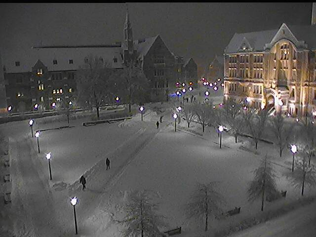

# Pull Live Photos from the Boston College Campus Webcams

Fairly self explanatory. BC has public webcams throughout its campus. This is a series of scripts to download photos from these cams. 

**Getting Started**
* [Download Chrome Driver](https://sites.google.com/a/chromium.org/chromedriver/) if you don't already have it
* Clone this repo
* Update the paths to chromedriver in the scripts you plan to use
* Run the file for whichever cam you want data from. For example: 

```
python gasson.py
```

---

